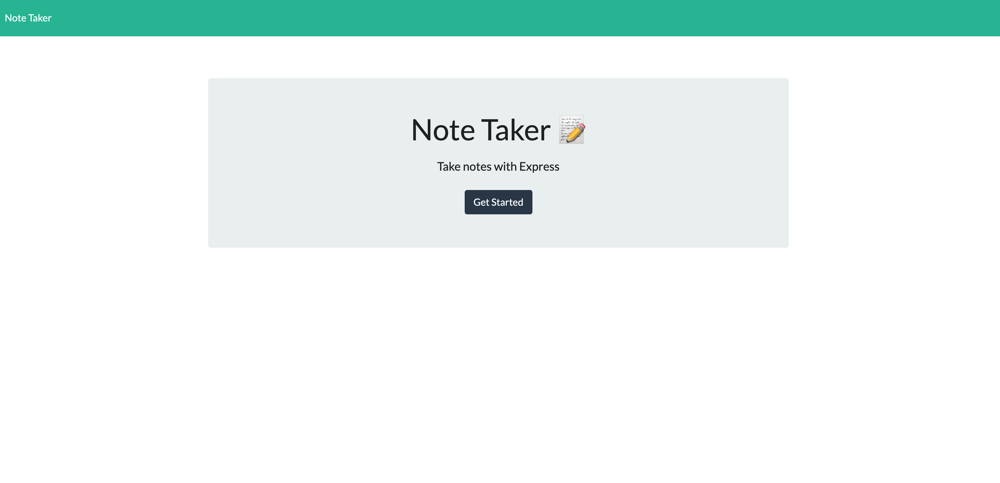
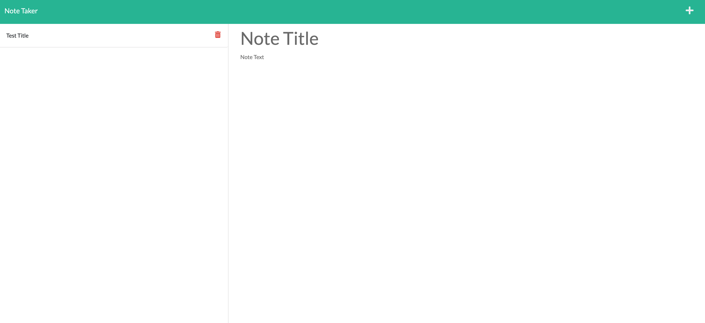

# Note Taker Starter Code
  ## Description
  #### This challenge is to create an application called Note Taker that can be used to write and save notes. The purpose of this is to use Node, Javascript, Express, and Heroku to create the application.

  ## Table of Contents
  * [Description](#description)
  * [Installation](#installation)
  * [Usage](#usage)
  * [Screenshot](#screenshot)
  * [Links](#links)
  * [Contribution](#contribution)
  * [Questions](#questions)
  * [GitHub Username](#github-username)

  ## Installation
  #### In order for the application to work when using server, you would need to first install npm ("npm i") in the terminal.
  ## Usage
  #### To use this in the server, type in "node server" in the terminal. Then open localhost:3001.
  ## Screenshot
  #### 
  #### 
  ## Links
  #### These are my deployed application links:
  #### [GitHub](https://github.com/rtleib/note-taker)
  #### [Heroku](https://note-taker-rtleib.herokuapp.com/)
  ## Contribution
  #### Thank you to [Coding Boot Camp](https://github.com/coding-boot-camp/miniature-eureka) for the starter code. I also would like to thank my tutor, the UTSA TAs, and my classmates for assisting me in this challenge.
  ## Questions
  #### For additional questions, please contact me in this email address: rtleib@gmail.com.
  ## GitHub Username 
  #### My username for GitHub is [rtleib](https://github.com/rtleib).